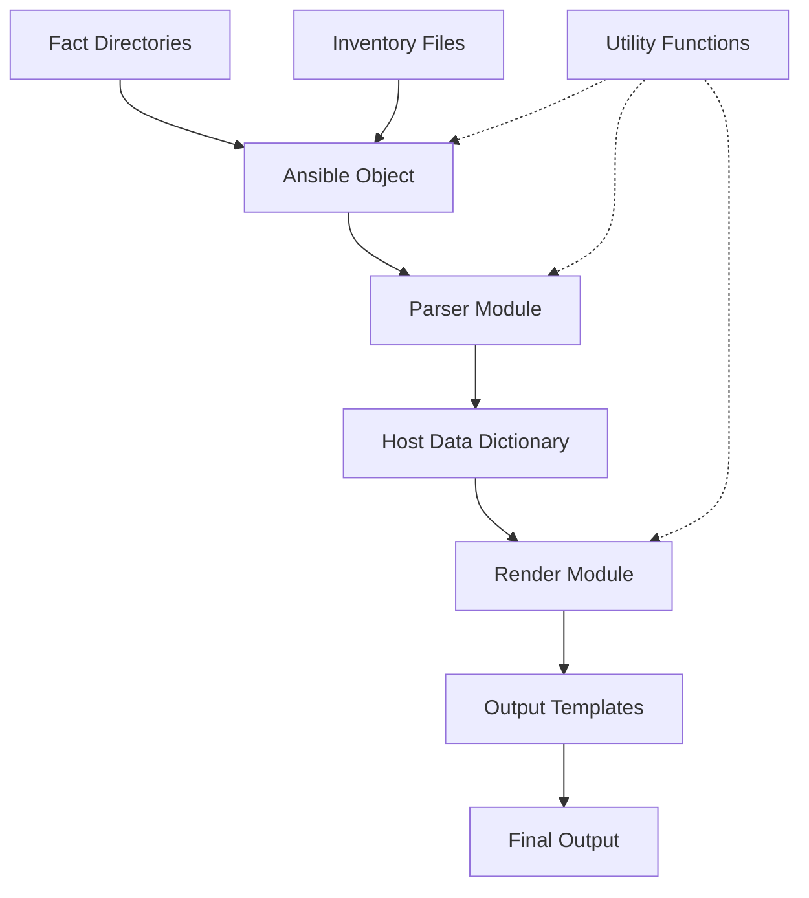
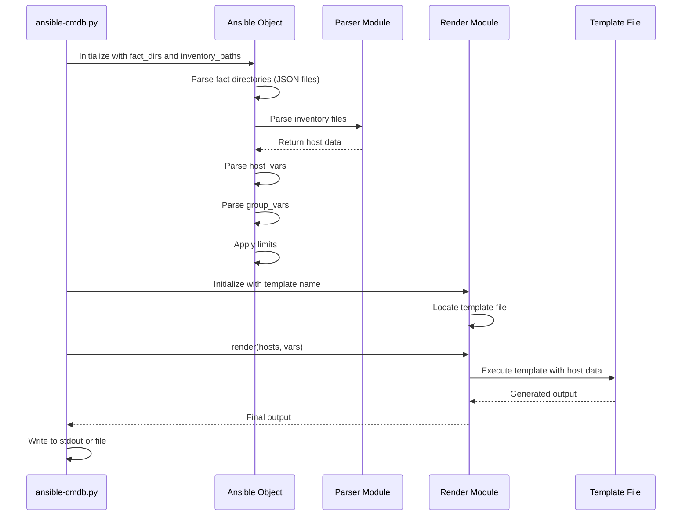

Ansible-cmdb is designed with a modular architecture that separates concerns into distinct components. This guide explains how these components work together to transform Ansible fact data into various output formats.

## High-Level Architecture



## Core Components

Ansible-cmdb consists of four main Python modules:

### ansible.py - Main Orchestrator

The `Ansible` class is the central component responsible for gathering and managing all host information.

**Key Responsibilities:**

- Parsing fact directories containing JSON output from Ansible's setup module
- Processing inventory files (static hosts files and dynamic inventory scripts)
- Parsing host_vars and group_vars directories
- Managing the complete host information dictionary
- Applying limits to filter hosts

**Main Workflow:**

<Steps>
  <Step title="Initialization">
    The `Ansible` object is instantiated with paths to fact directories and optional inventory paths.
  </Step>

  <Step title="Fact Parsing">
    For each fact directory, `_parse_fact_dir()` is called to read JSON files containing host facts gathered by Ansible's setup module.
  </Step>

  <Step title="Inventory Scanning">
    If inventory paths are provided (`-i` option), the system scans for:
    - Static hosts files (parsed by `HostsParser`)
    - Dynamic inventory scripts (executable files)
    - Directory structures containing multiple inventory files
  </Step>

  <Step title="Variable Collection">
    The system scans for and applies:
    - Host-specific variables from `host_vars/` directories
    - Group variables from `group_vars/` directories
  </Step>

  <Step title="Deep Update">
    All information is merged using the `update_host()` method, which performs deep dictionary updates to overlay facts, variables, and inventory data.
  </Step>
</Steps>

**Key Methods:**

- `update_host(hostname, key_values, overwrite=True)` - Deep-updates host information
- `get_hosts()` - Returns the final list of hosts with limits applied
- `hosts_in_group(groupname)` - Returns hosts belonging to a specific group

### parser.py - Inventory Parser

The parser module contains classes for parsing different inventory formats.

#### HostsParser

Parses Ansible hosts inventory files and generates a dictionary of hosts with their groups and variables.

**Parsing Process:**

1. **Section Identification**: Identifies sections in the inventory file:
   - `[groupname]` - Regular host groups
   - `[groupname:children]` - Parent groups
   - `[groupname:vars]` - Group variables

2. **Host Expansion**: Supports Ansible's host pattern syntax:
   ```
   web[01:10].example.com  # Expands to web01-web10
   db[a:c].example.com     # Expands to dba, dbb, dbc
   ```

3. **Variable Application**: Applies variables from:
   - Inline host variables: `host1 ansible_port=2222`
   - Group variables from `:vars` sections
   - Parent group memberships from `:children` sections

**Key Methods:**

- `expand_hostdef(hostdef)` - Expands host patterns into individual hostnames
- `_parse_line_entry(line, type)` - Parses individual inventory lines
- `_apply_section(section, hosts)` - Applies section data to hosts

#### DynInvParser

Parses JSON output from dynamic inventory scripts.

**Features:**

- Handles the `_meta` section for host variables
- Processes group definitions with hosts and vars
- Supports both dict and list formats for group definitions

### render.py - Template Renderer

The `Render` class is a wrapper that facilitates template rendering using Mako or Python-based templates.

**Template Types:**

1. **Mako Templates** (`.tpl` files):
   - Used for most output formats (HTML, CSV, Markdown, etc.)
   - Supports template inheritance and includes
   - Full access to host data and custom variables

2. **Python Templates** (`.py` files):
   - Executable Python scripts for complex rendering logic
   - Used for formats like `html_fancy_split` and `markdown_split`
   - Must implement a `render(hosts, vars, tpl_dirs)` function

**Rendering Process:**

<Steps>
  <Step title="Template Discovery">
    Searches for templates in specified directories:
    - Direct file path if provided
    - `{template_name}.tpl` in template directories
    - `{template_name}.py` in template directories
  </Step>

  <Step title="Template Loading">
    Loads the template with proper Mako configuration:
    - UTF-8 encoding for input and output
    - Error replacement for encoding issues
    - Template lookup for includes
  </Step>

  <Step title="Rendering">
    Executes the template with:
    - `hosts` - Dictionary of all host data
    - Custom variables passed via `-p` option
  </Step>
</Steps>

### util.py - Utility Functions

Provides helper functions used throughout the codebase:

**Key Functions:**

- `deepupdate(target, src, overwrite=True)` - Recursively merges dictionaries, lists, and sets. This is crucial for combining data from multiple sources (facts, inventory, host_vars, group_vars).

- `is_executable(path)` - Determines if a file is executable, used to identify dynamic inventory scripts.

- `find_path(dirs, path_to_find)` - Searches for a file across multiple directories.

- `to_bool(s)` - Converts string values to boolean.

**Deep Update Behavior:**

```python
# Lists are extended
t = {'hobbies': ['programming']}
deepupdate(t, {'hobbies': ['gaming']})
# Result: {'hobbies': ['programming', 'gaming']}

# Dicts are recursively merged
t = {'config': {'debug': True}}
deepupdate(t, {'config': {'verbose': True}})
# Result: {'config': {'debug': True, 'verbose': True}}

# Sets are updated
t = {'groups': {'web', 'prod'}}
deepupdate(t, {'groups': {'monitoring'}})
# Result: {'groups': {'web', 'prod', 'monitoring'}}
```

## Data Flow

Here's how data flows through ansible-cmdb:



## Extension Points

Ansible-cmdb is designed to be extensible:

### Custom Templates

Create your own output formats by writing:

- **Mako templates** for simple text-based formats
- **Python templates** for complex multi-file outputs

Templates have access to:
- `hosts` - Complete host data dictionary
- Custom parameters passed via `-p key=value`

### Custom Facts

Extend host information by:

1. Creating additional JSON files in a separate directory
2. Passing the directory to ansible-cmdb alongside fact directories
3. Data is automatically merged with existing host information

### Dynamic Inventory

Integrate with external systems using dynamic inventory scripts that output JSON in Ansible's format.

## File Organization

```
src/ansiblecmdb/
├── __init__.py          # Package initialization
├── ansible.py           # Main Ansible class
├── parser.py            # Inventory parsers
├── render.py            # Template renderer
├── util.py              # Utility functions
├── ihateyaml.py         # YAML parser wrapper
└── data/
    ├── tpl/             # Built-in templates
    │   ├── html_fancy.tpl
    │   ├── html_fancy_split.py
    │   ├── csv.tpl
    │   ├── markdown.tpl
    │   └── ...
    └── static/          # Static assets (CSS, JS)
```

## Dependencies

Ansible-cmdb relies on these key Python packages:

- **Mako** - Template engine for generating output
- **PyYAML** - Parsing YAML files (host_vars, group_vars)
- **ushlex** - Unicode-aware shell lexer for Python 2
- **jsonxs** - JSON parsing with additional features

## Source Code

The ansible-cmdb source code is available on GitHub:

[https://github.com/fboender/ansible-cmdb](https://github.com/fboender/ansible-cmdb)

For more details on contributing and development, see the [Contributing Guide](/development/contributing).
